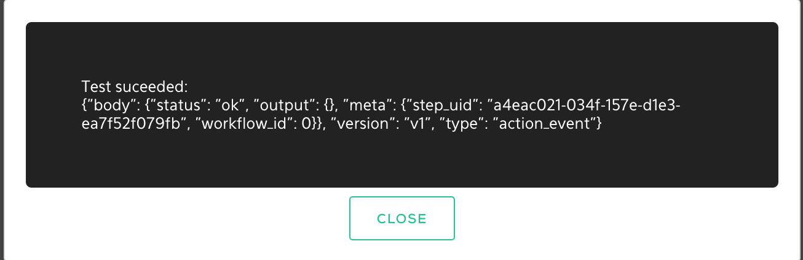

<!-- START doctoc generated TOC please keep comment here to allow auto update -->
<!-- DON'T EDIT THIS SECTION, INSTEAD RE-RUN doctoc TO UPDATE -->

- [Writing your Python Plugin](#writing-your-plugin)
  - [Required Variables](#required-variables)
  - [Parameters](#parameters)
  - [Logging](#logging)
  - [Cache](#cache)
  - [Plugin Status](#plugin-status)
  - [Tests](#test)
  - [Methods](#methods)
  - [Verifying](#verifying)

## Writing your Plugin

The following sections document things you need to know to develop quality plugins.

### Required Variables

Output variables which are defined as `required: false`, the default, don't have to be returned as JSON from the plugin.
They can be omitted and in some cases it's better to omit them. For example, the finger plugin tries to grab many
attributes of a user from the finger daemon such as the real name, shell, home directory, etc.. There's no guarantee that
all the attributes will have values, and in some cases, the absence of values doesn't mean our plugin failed. When this
is true, we can omit returning the key/value pairs instead of setting them to empty. This is a better practice because
another plugin that depends on the output variable as input in the workflow will not get an empty value and try to
proceed with it but rather the workflow stops there.

Example of returning all variables, irrespective of them having a meaningful value:
```
variables = {
  'Host': ip,
  'Name': 'N/A', # Not available is used to illustrate non-meaningful
}

return variables
```

Example of returning only meaningful variables:
```
if ip is not '':
  variables['Host'] = ip
if fullname is not '':
  variables['Name'] = fullname

return variables
```

In other words, don't do this:


### Parameters

Input variables defined in the spec file are available in a dictionary called `params` where the value can be accessed
by the variable/key name, these are our input variables names described in the `plugin.spec.yaml` file.
We can do this the long way or in shorter form:
```
# Python
self.input.parameters['var']
params['var']
```

We can also use the better `params.get()` method which

* Allows optional default value if the key is missing 
* Returns `None` if the key is missing whereas `params['var'] would raise `KeyError`.

```
value = params.get('var', 'blah')
```

### Logging

Log informational messages including warnings and errors, they're displayed to the user in the Log section of the Job Output.


Informational logging can be done by raising an exception or logging directly, a few examples are below. 
```
# Python
logging.info("connecting")
raise ValueError('connecting')
raise Exception('connecting')
```

Note that the raising of exceptions will cause the plugin to fail.

### Cache

Plugins can use persistent storage for caching files using the `enable_cache: true` in the metadata section of plugin spec file.
`/var/cache` can then be used for storage across all the plugin's containers but not in containers of other plugins. For plugins that download down files from the internet, it makes it easy to check if the file already exists in the cache.

Example
```
import os
...
cache_dir  = '/var/cache'
cache_file = cache_dir + '/' + 'mycache'

if os.path.isdir(cache_dir):
  if os.path.isfile(cache_file):
    f = open(cache_file, 'rw')
    contents = f.read()
    # Do comparison
  else:
    # Create cachefile for next time
```

### Plugin Status

Plugin failures are caused by raising exceptions. Do this when something doesn't go right and the next best option is to fail.
```
# Python
raise ValueError('connecting')
raise Exception('connecting')
```

### Tests

The test method is used to provide tests of the plugin by returning JSON. It should be completed with practical test(s) of plugin functionality.
Raising an exception will cause the test method to fail.

```
# Python
def test(self, params={}):
  """TODO: Test action"""
  return {}
```

Tests are executed in the Komand WUI after configuring a plugin. A log of the JSON output is also viewable.




The user parameters are available in the method as well.

Testing Examples:
* Successful connections to API or service
* Validating known output of command

Example for testing the `hashit` plugin that generates hashes of a string. We can test that hashing works by comparing
known hashes of a string against the code the hashit plugin uses to generate them. An exeception is raised if the hashes
do not match, otherwise upon success we return the JSON object of hashes.
```
def test(self, params={}):
        a = 'test'
        # Hashes of 'test'
        real_hashes = {
          'md5': '098f6bcd4621d373cade4e832627b4f6',
          'sha1': 'a94a8fe5ccb19ba61c4c0873d391e987982fbbd3',
          'sha256': '9f86d081884c7d659a2feaa0c55ad015a3bf4f1b2b0b822cd15d6c15b0f00a08',
          'sha512': 'ee26b0dd4af7e749aa1a8ee3c10ae9923f618980772e473f8819a5d4940e0db27ac185f8a0e1d5f84f88bc887fd67b143732c304cc5fa9ad8e6f57f>
        }

        test_hashes={}
        test_hashes['md5']    = hashlib.md5(a).hexdigest()
        test_hashes['sha1']   = hashlib.sha1(a).hexdigest()
        test_hashes['sha256'] = hashlib.sha256(a).hexdigest()
        test_hashes['sha512'] = hashlib.sha512(a).hexdigest()

        # Test against correct hashes of string 'test'
        for alg in real_hashes:
          if test_hashes[alg] != real_hashes[alg]:
            raise Exception('Hash failed')

        return test_hashes
```

### Methods

Use good programming practices such as breaking the program into smaller functions or methods. This makes the plugins more readable and manageable.

An example below is provided that we can use instead of doing a bunch of `re.search`es and conditionals to test the existence of a value.
The regex in the `get_value` method extracts the value from the `\nkey: value` pair match in the stdout string.

```
...
def get_value(self, key, stdout):
    '''Extracts value from key: value pair'''
    # Example: regex = "\nDomain Name: (google.com)\n"
    regex = r"\n" + re.escape(key) + r": (.*)\n" 
    r = re.search(regex, stdout)
    # Only return the value in the group 1 if it exists
    if hasattr(r, 'group'):
      if r.lastindex == 1:
        return r.group(1)
...

def run(self, params={}):
# Initialize list with keys for matching
  keys = [
    'Domain Name',
    'Registrar WHOIS Server',
    'Updated Date',
    'Creation Date',
    'Registrar',
    'Registrar Abuse Contact Email',
    'Registrar Abuse Contact Phone',
    'Registrant Country',
  ]

  for key in keys:
    # Iterate over keys and store the extracted values into results 
    results[key] = self.get_value(key, stdout)
  
  return results
```

Once you define the function you can call it in the same python file by referring to itself e.g. `self.get_value(...)`

### Verifying

Before committing the plugin, always verify that the functionality works to the top of the stack. Plugins should be user
friendly and the best way to test and figure out if your plugin meets those requirements is to get it working in Komand
product. All developers should do this.


1. Open up the web interface `https://127.0.0.1:3000` for the Vagrant config
2. Authenticate
3. `Settings -> Import A Plugin`
4. Choose the tarball that the `makefile` generated
5. Create a Workflow to use it, it's easiest to use the API Trigger to kick it off.


6. Publish the workflow
7. Start the workflow by executing the CURL command with the necessary inputs
```
curl -X POST -d '{"blah": "things", "blah2": "morethings"}' http://komand.dev.komand.local:8000/v2/workflows/46/events?api_key=b943197b-7d3f-4c77-b704-c2e4c55c6c
```
8. Check the closed jobs for the results

Make sure everything makes sense especially the text used to described the plugin, its input, and outputs.
