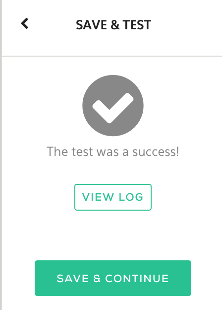

<!-- START doctoc generated TOC please keep comment here to allow auto update -->
<!-- DON'T EDIT THIS SECTION, INSTEAD RE-RUN doctoc TO UPDATE -->

- [Writing your Python Plugin](#writing-your-plugin)
  - [Required Variables](#required-variables)
  - [Parameters](#parameters)
  - [Logging](#logging)
  - [Cache](#cache)
  - [Plugin Status](#plugin-status)
  - [Tests](#test)

### Writing your Plugin

The following sections document things you need to know to develop quality plugins.

#### Required Variables

Output variables which are defined as `required: false`, the default, don't have to be returned as JSON from the plugin.
They can be omitted and in some cases it's better to omit them. For example, the finger plugin tries to grab many
attributes of a user from the finger daemon such as the real name, shell, home directory, etc.. There's no guarantee that
all the attributes will have values, and in some cases, the absence of values doesn't mean our plugin failed. When this
is true, we can omit returning the key/value pairs instead of setting them to empty. This is a better practice because
another plugin that depends on the output variable as input in the workflow will not get an empty value and try to
proceed with it but rather the workflow stops there.

Example of returning all variables, irrespective of them having a meaningful value:
```
variables = {
  'Host': ip,
  'Name': 'N/A', # Not available is used to illustrate non-meaningful
}

return variables
```

Example of returning only meaningful variables:
```
if ip is not '':
  variables['Host'] = ip
if fullname is not '':
  variables['Name'] = fullname

return variables
```

In other words, don't do this:


#### Parameters

Input variables defined in the spec file are available in a dictionary called `params` where the value can be accessed by the variable/key name.
We can do this the long way or in shorter form:
```
# Python
self.input.parameters['var']
params['var']
```

#### Logging

Log informational messages including warnings and errors, they're displayed to the user in the Log section of the Job Output.


Informational logging can be done by raising an exception or logging directly, a few examples are below. 
```
# Python
logging.info("connecting")
raise ValueError('connecting')
raise Exception('connecting')
```

Note that the raising of exceptions will cause the plugin to fail.

### Cache

Plugins can use persistent storage for caching files using the `enable_cache: true` in the plugin spec file.
`/var/cache` can then be used for storage across all the plugin's containers.

### Plugin Status

Plugin failures are caused by raising exceptions. Do this when something doesn't go right and the next best option is to fail.
```
# Python
raise ValueError('connecting')
raise Exception('connecting')
```

#### Tests

The test method is used to provide tests of the plugin by returning JSON. It should be completed with practical test(s) of plugin functionality.
Raising an exception will cause the test method to fail.

```
# Python
def test(self, params={}):
  """TODO: Test action"""
  return {}
```

Tests are executed in the Komand WUI after configuring a plugin. A log of the JSON output is also viewable.




The user parameters are available in the method as well.

Testing Examples:
* Successful connections to API or service
* Validating known output of command

Example for testing the `hashit` plugin that generates hashes of a string. We test against known hashes of a string.
```
def test(self, params={}):
        a = 'test'
        # Hashes of 'test'
        real_hashes = {
          'md5': '098f6bcd4621d373cade4e832627b4f6',
          'sha1': 'a94a8fe5ccb19ba61c4c0873d391e987982fbbd3',
          'sha256': '9f86d081884c7d659a2feaa0c55ad015a3bf4f1b2b0b822cd15d6c15b0f00a08',
          'sha512': 'ee26b0dd4af7e749aa1a8ee3c10ae9923f618980772e473f8819a5d4940e0db27ac185f8a0e1d5f84f88bc887fd67b143732c304cc5fa9ad8e6f57f>
        }

        test_hashes={}
        test_hashes['md5']    = hashlib.md5(a).hexdigest()
        test_hashes['sha1']   = hashlib.sha1(a).hexdigest()
        test_hashes['sha256'] = hashlib.sha256(a).hexdigest()
        test_hashes['sha512'] = hashlib.sha512(a).hexdigest()

        # Test against correct hashes of string 'test'
        for alg in real_hashes:
          if test_hashes[alg] != real_hashes[alg]:
            raise Exception('Hash failed')

        return test_hashes
```
