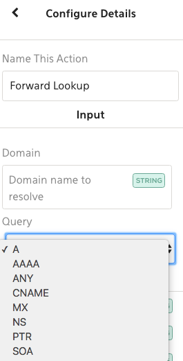
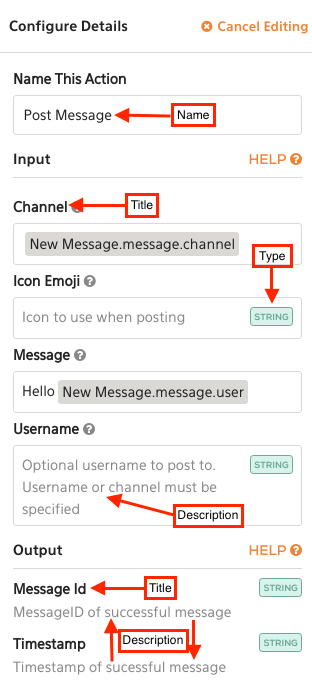

<!-- START doctoc generated TOC please keep comment here to allow auto update -->
<!-- DON'T EDIT THIS SECTION, INSTEAD RE-RUN doctoc TO UPDATE -->


- [Introduction](#introduction)
- [Example: Creating a plugin](#example-creating-a-plugin)
  - [Step 1: Defining the Plugin Specification](#step-1-defining-the-plugin-specification)
    - [Metadata section](#metadata-section)
    - [Types section](#types-section)
    - [Connection section](#connection-section)
    - [Triggers section](#triggers-section)
    - [Actions section](#actions-section)
  - [Step 2: Codegenerating the Plugin Shell](#step-2-codegenerating-the-plugin-shell)
  - [Step 3: Exploring Plugin Commands](#step-3-exploring-plugin-commands)
    - [`info` command](#info-command)
    - [`sample` command](#sample-command)
    - [`test` command](#test-command)
    - [`run` command](#run-command)
  - [Step 4: Implementing an action](#step-4-implementing-an-action)
  - [Step 5: Installing your plugin for use in Komand](#step-5-installing-your-plugin-for-use-in-komand)
    - [Option #1: Install package via Komand line](#option-1-install-package-via-komand-line)
    - [Option #2: Install package via UI](#option-2-install-package-via-ui)

<!-- END doctoc generated TOC please keep comment here to allow auto update -->

## Introduction

So you want to build a plugin with Komand?  You've come to the right place!

Plugins in Komand can be built currently using Python or Go.  

Plugins support any number of `triggers` or `actions`.  Plugins are defined using a `plugin.spec.yaml`, and a plugin shell can be codegen'd using `komand plugin generate [python|go] <path/to/plugin.spec.yaml>`. 

When writing plugins, it's recommended to work directly out of the `plugins` repository. Locate your `plugins.spec.yaml` to `plugins/plugin.spec.yaml` and generate the skeleton from there so it fits nicely with the other plugins.

## Example: Creating a plugin

### Step 1: Defining the Plugin Specification

Let's define a simple plugin we will implement using Python.

First, create a file called `plugin.spec.yaml` and populate it with some data:

```yaml
plugin_spec_version: v1
name: example 
title: "Example Descriptive Title"
description: "Example plugin"
version: 0.1.0
vendor: acmecorp 
tags: ["example"]
icon: "data:image/png;base64,iVBORw0KGgoAAAANSUhEUgAAADIAAAAjCAYAAADWtVmPAAAABGdBTUEAALGPC/xhBQAAA6hJREFUWAnVWEloFEEUnclCFE0MBqJGjYiBiHpQRMUFJbgFxQV0Bg/xogc3cEPcEBVB8aBeFIQIogdRQXPQXBRJhKighxAIeBARFxT3lWjiNr7X/go/nV5mOjPJ9IdH/V+/6td/VdXV1R1NJBLtkUikAAizxHPCnL3OnUTadEVI9Q4SmQ60hpRAAnkfB+qt/PGc9AdqgTDJeyS7uHMBYIwzBvRVwFcg26UJCY5QeQ+NoOITsFZVVsBuBrJR/iKpI0Au80U5GLgGxGi0A5QLQKE0KIB+ipVZJG+QywI14TNhP5f8uhBh3SNgomq8AvZnOvpYGjD+MJnkKPQ9wC+VUzci9HGFNikyo2E/oKMP5A/GPAhY7zuUpcANwC6OREyjK1CKZRbyoZ8wjl4qX2GcKjWhVbBZ5ySeRNjhCTBVBVsC+wMdGRbOeqlMYg50rgpXx018ibDjT2A7EJXAI6HfBTIhvxF0L2DGKoPeCPhJUkRMkOtQSoRMHvSjAI/DdMkLBJqlVn8h7LdJBk+JCGPaB6tOYTCvnOrh7MkkpUyEyTgt/22vLD183LY7ALOVyqEH2baBiJi8bkIxD2Qu9EOA1wNp+pnyKZRpaisthR30IOkRESbE49AiI8/OXNiv6fCROvito136rfNp7+fuERE+6BvMjJoSdUOAWy4jd6B+s2lrStQVAk0ufZKpDkyEW2iNSmQr7EagjHUoefbvA/g8GXkMZbLqE4PdClRInwHQG4AgEogIk6tRCe1SI/O4rFa+2bBfApeBIkm4H/TTgBH6x4qP30VOVxDT1q1MmQgvajGV6AGHyNxyfMfkSXIDVftK1Lc49OHNdoK0582b76xUJCUi3N/LVFL8LvCSe3CWq/Y1sL95dHgH3yQhkw/9qkdbuytpIj/Qc5FKKtkL5Ef0iwNn7SO72Gw/Rcjw9nDRpZ29Oikibeg1T4LzWyDTH1xfMMYMGY+HxjnAT3yJcCvMUUHP+EVMk1+Py8mr9YnrSUTPDN/c532Cpdv9HQHnq51w0mMAVyL2vXrJI0gmXfxa7fzlA/2Yy2CORHh6WN/tKHl61Ll07q1qnpbLuTIU6IcdBu5GhPek8dKB5zmv19kgfH/FLSb/yey3JdWFCN+wlUIi6BvWFj+tJm8UqxWZnSp6J5FnqBwjJHjnaVSNsknlHU//TNwiyVlEHsIYJSSKoN8RZ7YWvAJtVCuzHvZKPjzDhUQx9PtAWGSbIjPI0pF5CdAcFgYqz92GzD8I1+y51g74CAAAAABJRU5ErkJggg=="
enable_cache: true
help: >
  This example plugin generates a personal greeting and goodbye message.
    Example API [Documentation](https://blah.com/api)

types:
  person:
     first_name: 
       type: string
     last_name: 
       type: string
     
connection:
  hostname: 
    type: string
    description: "Enter the hostname"
  port:
    type: integer
    description: "Enter the port"
    default: 80
  username: 
    type: string
    description: "Enter the username"

triggers:
  emit_greeting:
    name: "Trigger a new greeting"
    description: "Triggers a greeting every 15 seconds (or whatever frequency is set to)."
    input:
      frequency: 
        type: integer
        description: "How frequently (in seconds) to trigger a greeting"
        default: 15
    output:
      greeting: 
        title: "Greeting"
        type: person 

actions:
  say_goodbye:
    name: "Say goodbye"
    description: "Say goodbye."
    input:
      name: 
        type: string 
        description: "Name to say goodbye to"
    output:
      message:
        title: "Message"
        type: string 

```

Let's review this file in detail.

#### Metadata section

At the top of the spec, you define metadata about your plugin such as the name, version, tags.

  * Please be sure to update the `vendor`, `name`, and `version` with the proper data. You can use letters, numbers, and underscores.  The vendor must be a unique vendor name. You can optionally provide a `title` which will be uploaded to the Komand UI.

  * `icon`: You can optionally provide a base64 encoded icon to be used by your plugin.

  * `tags`: Optional tags that describe your plugin's functionality.
  
  * `enable_cache`: Persistent storage in `/var/cache` across a plugin's containers. Cache can be tested via `docker run -v /var/cache:/var/cache -i komand/myplugin --debug run < tests/blah.json`

  * `help`: Property to display detailed information about the plugin and used in our Marketplace website

#### Types section

The types section defines any custom complex type objects you have defined. It is in the format of the map which has the `type name` identifier as the key, and then an object definition
that describes the property for the object.  You can use these types later in your plugin specification as types for your input/output parameters, or within your connection definition. 

```yaml
types:
  <type name>:
     <parameter #1 identifier>:
        type: <choose from a valid type>
        name: <optional, descriptive name for the UI>
        description: <optional, string description>
        default: <optional,  default>
        required: <optional, true or false, default is false. Set to true if required>
     <parameter #2 identifier>:
        type: <choose from a valid type>
        name: <optional, descriptive name for the UI>
        description: <optional, string description>
        default: <optional,  default>
        required: <optional, true or false, default is false. Set to true if required>
     ...

```

In the example at the beginning of this document, we defined a custom type called `person` that has two properties: `first_name` and `last_name`.

The type must be selected from one of the valid types below:

| Type    | Description            | 
| --------| -----------------------|
| boolean | true or false          | 
| integer | integer is a signed integer  | 
| string  | string value           | 
| date    | date string value (In RFC 3339 format) per the JSON schema   |
| bytes   | bytes are base64 encoded byte strings |
| object  | Generic JSON object    |
| file    | File object with filename (string) and base64 content bytes| 


You can also specify a collection (array) type by doing `[]<base type>` wrapped in strings, e.g.: `type: "[]string"`.  You must wrap it in quotes.

These types will now be available in the `connection` sections, `trigger` input/output, and `action` input/output sections to use in addition to the base types.

Enums can be used to limit and declare the possible options for an input field. 
```
actions:
  forward:
    name: "Forward Lookup"
    description: "Forward DNS Query"
    input:
      domain:
        type: "string"
        description: "Domain name to resolve"
        required: true
      query:
        type: "string"
        description: "Optional query type e.g. ANY, A, MX, NS, etc."
        enum:
        - "A"
        - "AAAA"
        - "ANY"
        - "CNAME"
        - "MX"
        - "NS"
        - "PTR"
        - "SOA"
```

The enumerated types are selectable from a drop-down box in the WUI.



#### Connection section

The connection section defines the configuration variables you need for a connection. If your plugin does not require a connection, you can remove this section.

If a connection does exist, the UI will render a 'Configure Connection' page for the values in the Workflow Builder.

In connection, each variable is defined in a map with its identifier.  The identifier must be unique, all lower cases, with letters/numbers/underscores permitted only.

```yaml
<identifier>:
   type: <choose from a valid type>
   name: <optional, descriptive name for the UI>
   description: <optional, string description>
   default: <optional,  default>
   required: <optional, true or false, default is false. Set to true if required to set a value>
```

#### Triggers section

Triggers are long running processes that kick off workflows. All worksflows must start with a trigger.
This is in contrast to actions which must occur after a trigger in a workflow and are short lived processes that run and then die.

The code for triggers are ran in the body of a continuous loop where the purpose is to poll for a new event. When
the event is found, the plugin triggers a workflow with the found event as JSON by passing it to the next plugin in the
workflow. Trigger example:

1. Poll an RSS feed for new content
2. When new content is available, pass the content as JSON to the engine
3. Sleep for x minutes
4. Repeat

A plugin can define 0 or more triggers.  Simply create a section `triggers` and add a map 
(defined by unique key) for each of the triggers you support.

```yaml
triggers:
  <unique trigger identifier>:
     title: <optional, descriptive name for the UI>
     description: <optional, string description>
     input: <optional, map of identifier -> variable inputs> 
     output: <map of identifier -> variable outputs>
```

#### Actions section

A plugin can define 0 or more actions.  Simply create a section `actions` and add a map 
(defined by unique key) for each of the actions you support.

```yaml
actions:
  <unique action identifier>:
     title: <optional, descriptive name for the UI>
     description: <optional, string description>
     input: <optional, map of identifier -> variable inputs> 
     output: <map of identifier -> variable outputs>
```

#### UI Rendering

The `name`, `title`, `description` etc. properties from the spec file are rendered in the UI in the following ways:

##### Action & Trigger Selection


##### Action & Trigger Configuration


### Step 2: Codegenerating the Plugin Shell

Now that you have a valid plugin spec file, you can codegenerate a plugin shell.  You need to have the `komand plugin` tool installed which is installed with Komand along with other tools in (/opt/komand/).

Run it as follows:  `komand plugin generate python plugin.spec.yaml`.  You may change `plugin.spec.yaml` to the path of your plugin spec. By default, it will generate the plugin a folder with the same `name` as you defined in your plugin spec yaml. You can also use the `--path`  flag to specify a custom path to generate your plugin inside of.

```bash
$ komand plugin generate python plugin.spec.yaml --path /tmp/example
INFO[0000] Writing to file: /tmp/example/example/triggers/__init__.py 
INFO[0000] Writing to file: /tmp/example/example/actions/say_goodbye.py 
INFO[0000] Writing to file: /tmp/example/example/actions/__init__.py 
INFO[0000] Writing to file: /tmp/example/example/connection.py 
INFO[0000] Writing to file: /tmp/example/example/__init__.py 
INFO[0000] Writing to file: /tmp/example/bin/example    
INFO[0000] Writing to file: /tmp/example/setup.py       
INFO[0000] Writing to file: /tmp/example/Makefile       
INFO[0000] Writing to file: /tmp/example/Dockerfile     
INFO[0000] Code generation completed! Your plugin is located at: /tmp/example 
```

Our plugin above was generated in `/tmp/example`.  You should be able to build it now by going to the folder and typing `make`

```bash
$ cd /tmp/example
$ make 
docker build --no-cache -t acmecorp/example:0.1.0 .
Sending build context to Docker daemon 19.46 kB
Step 1 : FROM komand/python-plugin:0.2
 ---> fee6169b0518
Step 2 : ADD ./plugin.spec.yaml /plugin.spec.yaml
 ---> 8b7b4792a573
Removing intermediate container ab18bbbea34d
Step 3 : ADD . /python/src
 ---> 7418585c7a33
Removing intermediate container d9b14ae73f2e
Step 4 : WORKDIR /python/src
 ---> Running in 8417e8808f91
 ---> 065ecf929359
Removing intermediate container 8417e8808f91
Step 5 : RUN make plugin
 ---> Running in 619761ebe080
python setup.py install	
running install
running bdist_egg
running egg_info
creating example_acmecorp_plugin.egg-info
writing requirements to example_acmecorp_plugin.egg-info/requires.txt
writing example_acmecorp_plugin.egg-info/PKG-INFO
writing top-level names to example_acmecorp_plugin.egg-info/top_level.txt
writing dependency_links to example_acmecorp_plugin.egg-info/dependency_links.txt
writing manifest file 'example_acmecorp_plugin.egg-info/SOURCES.txt'
reading manifest file 'example_acmecorp_plugin.egg-info/SOURCES.txt'
writing manifest file 'example_acmecorp_plugin.egg-info/SOURCES.txt'
installing library code to build/bdist.linux-x86_64/egg
running install_lib
running build_py
creating build
creating build/lib
creating build/lib/example
copying example/connection.py -> build/lib/example
copying example/__init__.py -> build/lib/example
creating build/lib/example/actions
copying example/actions/say_goodbye.py -> build/lib/example/actions
copying example/actions/__init__.py -> build/lib/example/actions
creating build/lib/example/triggers
copying example/triggers/__init__.py -> build/lib/example/triggers
copying example/triggers/emit_greeting.py -> build/lib/example/triggers
creating build/bdist.linux-x86_64
creating build/bdist.linux-x86_64/egg
creating build/bdist.linux-x86_64/egg/example
copying build/lib/example/connection.py -> build/bdist.linux-x86_64/egg/example
creating build/bdist.linux-x86_64/egg/example/actions
copying build/lib/example/actions/say_goodbye.py -> build/bdist.linux-x86_64/egg/example/actions
copying build/lib/example/actions/__init__.py -> build/bdist.linux-x86_64/egg/example/actions
copying build/lib/example/__init__.py -> build/bdist.linux-x86_64/egg/example
creating build/bdist.linux-x86_64/egg/example/triggers
copying build/lib/example/triggers/__init__.py -> build/bdist.linux-x86_64/egg/example/triggers
copying build/lib/example/triggers/emit_greeting.py -> build/bdist.linux-x86_64/egg/example/triggers
byte-compiling build/bdist.linux-x86_64/egg/example/connection.py to connection.pyc
byte-compiling build/bdist.linux-x86_64/egg/example/actions/say_goodbye.py to say_goodbye.pyc
byte-compiling build/bdist.linux-x86_64/egg/example/actions/__init__.py to __init__.pyc
byte-compiling build/bdist.linux-x86_64/egg/example/__init__.py to __init__.pyc
byte-compiling build/bdist.linux-x86_64/egg/example/triggers/__init__.py to __init__.pyc
byte-compiling build/bdist.linux-x86_64/egg/example/triggers/emit_greeting.py to emit_greeting.pyc
creating build/bdist.linux-x86_64/egg/EGG-INFO
installing scripts to build/bdist.linux-x86_64/egg/EGG-INFO/scripts
running install_scripts
running build_scripts
creating build/scripts-2.7
copying and adjusting bin/example -> build/scripts-2.7
changing mode of build/scripts-2.7/example from 644 to 755
creating build/bdist.linux-x86_64/egg/EGG-INFO/scripts
copying build/scripts-2.7/example -> build/bdist.linux-x86_64/egg/EGG-INFO/scripts
changing mode of build/bdist.linux-x86_64/egg/EGG-INFO/scripts/example to 755
copying example_acmecorp_plugin.egg-info/PKG-INFO -> build/bdist.linux-x86_64/egg/EGG-INFO
copying example_acmecorp_plugin.egg-info/SOURCES.txt -> build/bdist.linux-x86_64/egg/EGG-INFO
copying example_acmecorp_plugin.egg-info/dependency_links.txt -> build/bdist.linux-x86_64/egg/EGG-INFO
copying example_acmecorp_plugin.egg-info/requires.txt -> build/bdist.linux-x86_64/egg/EGG-INFO
copying example_acmecorp_plugin.egg-info/top_level.txt -> build/bdist.linux-x86_64/egg/EGG-INFO
zip_safe flag not set; analyzing archive contents...
creating dist
creating 'dist/example_acmecorp_plugin-0.1-py2.7.egg' and adding 'build/bdist.linux-x86_64/egg' to it
removing 'build/bdist.linux-x86_64/egg' (and everything under it)
Processing example_acmecorp_plugin-0.1-py2.7.egg
Copying example_acmecorp_plugin-0.1-py2.7.egg to /usr/local/lib/python2.7/site-packages
Adding example-acmecorp-plugin 0.1 to easy-install.pth file
Installing example script to /usr/local/bin

Installed /usr/local/lib/python2.7/site-packages/example_acmecorp_plugin-0.1-py2.7.egg
Processing dependencies for example-acmecorp-plugin==0.1
Searching for komand==0.1
Best match: komand 0.1
Processing komand-0.1-py2.7.egg
komand 0.1 is already the active version in easy-install.pth

Using /usr/local/lib/python2.7/site-packages/komand-0.1-py2.7.egg
Searching for jsonschema==2.3.0
Best match: jsonschema 2.3.0
Adding jsonschema 2.3.0 to easy-install.pth file

Using /usr/local/lib/python2.7/site-packages
Searching for python-jsonschema-objects==0.0.22.post1
Best match: python-jsonschema-objects 0.0.22.post1
Adding python-jsonschema-objects 0.0.22.post1 to easy-install.pth file

Using /usr/local/lib/python2.7/site-packages
Searching for requests==2.9.0
Best match: requests 2.9.0
Adding requests 2.9.0 to easy-install.pth file

Using /usr/local/lib/python2.7/site-packages
Searching for pandocfilters==1.2
Best match: pandocfilters 1.2
Adding pandocfilters 1.2 to easy-install.pth file

Using /usr/local/lib/python2.7/site-packages
Searching for six==1.10.0
Best match: six 1.10.0
Adding six 1.10.0 to easy-install.pth file

Using /usr/local/lib/python2.7/site-packages
Searching for Markdown==2.4
Best match: Markdown 2.4
Adding Markdown 2.4 to easy-install.pth file

Using /usr/local/lib/python2.7/site-packages
Searching for inflection==0.2.0
Best match: inflection 0.2.0
Adding inflection 0.2.0 to easy-install.pth file

Using /usr/local/lib/python2.7/site-packages
Finished processing dependencies for example-acmecorp-plugin==0.1
 ---> 3310b32954ac
Removing intermediate container 619761ebe080
Step 6 : ENTRYPOINT /usr/local/bin/example
 ---> Running in a09ee1dd3bde
 ---> 7f38a94b21ad
Removing intermediate container a09ee1dd3bde
Successfully built 7f38a94b21ad
docker tag -f acmecorp/example:0.1.0 acmecorp/example:latest
Warning: '-f' is deprecated, it will be removed soon. See usage.
rm -rf acmecorp-example-0.1.0.tar.gz 
tar -cvzf acmecorp-example-0.1.0.tar.gz  --exclude=acmecorp-example-0.1.0.tar.gz  *
Dockerfile
Makefile
bin/
bin/example
example/
example/triggers/
example/triggers/__init__.py
example/triggers/emit_greeting.py
example/connection.py
example/actions/
example/actions/__init__.py
example/actions/say_goodbye.py
example/__init__.py
plugin.spec.yaml
setup.py
```

The `make` task does two things: Creates a `<vendor>/<name>` container with the plugin code, and also a `<vendor>-<name>-<version>.tar.gz` package that can be uploaded via `komand plugin register` or via the plugins UI within the Komand interface.
All of the plugins are built as Docker containers for easy packaging and running.  You can always type `make` during the process of writing your plugin to build the latest version of it.

### Step 3: Exploring Plugin Commands 

Now that your plugin shell has been built, let's play around with some of the Plugin commands that come code generated with the plugin shell.

To see what flags your plugin supports, try running:

```bash
$ docker run -i --rm  acmecorp/example --help
usage: example [-h] [--version] [--debug] {test,info,sample,run} ...

Example plugin.

positional arguments:
  {test,info,sample,run}
                        Commands
    test                Run a test using the start message on stdin
    info                Display plugin info (triggers and actions).
    sample              Show a sample start message for the provided trigger
                        or action.
    run                 Run the plugin (default command). You must supply the
                        start message on stdin.

optional arguments:
  -h, --help            show this help message and exit
  --version             Show version
  --debug               Log events to stdout
```


#### `info` command

The info command will print what triggers/actions your plugin supports.

```bash
$ docker run -i --rm  acmecorp/example info 
Name:        Example Descriptive Title
Vendor:      acmecorp
Version:     0.1.0
Description: Example plugin.

Triggers (1): 
└── emit_greeting (Triggers a greeting every 15 seconds (or whatever frequency is set to).)

Actions (1): 
└── say_goodbye (Say goodbye.)
```

#### `sample` command

The Komand system communicates with all of its plugins using JSON.  All of the plugin `test` or `run` commands require a JSON message on `stdin` that provides the JSON
input parameters and connection information.  The plugin can generate a `sample` of this message for you!

The sample command takes the `identifier` of your trigger or action as an argument, and generates a sample message 
to supply for the `test` or `run` commands.

To generate a sample JSON message for the `say_goodbye` action, for example, we can do this:

```bash
$ docker run -i --rm  acmecorp/example sample say_goodbye
{"body": {"action": "say_goodbye", "input": {"name": ""}, "connection": {"username": "", "hostname": "", "port": 0}, "meta": {}}, "version": "v1", "type": "action_start"}%  
```

To format the output nicely, you can use the `jq` command:

```bash
$ docker run -i --rm  acmecorp/example sample say_goodbye | jq "."
{
  "body": {
    "action": "say_goodbye",
    "input": {
      "name": ""
    },
    "connection": {
      "username": "",
      "hostname": "",
      "port": 0
    },
    "meta": {}
  },
  "version": "v1",
  "type": "action_start"
}
```

To save the output to a file, simply pipe the JSON to `stdout`:

```bash
$ docker run -i --rm  acmecorp/example sample say_goodbye | jq "." > action-msg.json
```

You will now have a sample message in `action-msg.json` you can use to test the plugin.  Fill out any `input` or `connection` values to use this sample message.

#### `test` command 

The `test` command is used for testing your plugin. You can implement an optional `test()` method in your action 
or trigger which will be used by the UI for testing connectivity.

```bash
docker run -i --rm  acmecorp/example --debug test  < action-msg.json    
```

We'll show an example of implementing an action test below. 

#### `run` command 

The `run` command is used for running your plugin. When developing, **please make sure you run your
plugin with the `--debug` flag** so that all output is displayed to `stdin/stdout` and so triggers can be tested.

```bash
docker run -i --rm  acmecorp/example --debug run < action-msg.json
```

We'll show an example of implementing an action `run` command below.

### Step 4: Implementing an action

Now that we have a plugin shell code generated for us, let us implement our `say_goodbye` action!

First, let's look at the structure of our plugin:

```bash
$ tree .
.
├── acmecorp-example-0.1.0.tar.gz
├── action-msg.json
├── bin
│   └── example
├── Dockerfile
├── example
│   ├── actions
│   │   ├── __init__.py
│   │   └── say_goodbye.py
│   ├── connection.py
│   ├── __init__.py
│   └── triggers
│       ├── emit_greeting.py
│       └── __init__.py
├── Makefile
├── plugin.spec.yaml
└── setup.py

4 directories, 13 files
```

You can see that there are two folders `example/actions` and `example/triggers`.  Each of the triggers or actions we defined will be in its own unique file here.

Let's look at `./example/actions/say_goodbye.py`:

```python
class SayGoodbye(komand.Action): 
    def __init__(self):
        super(self.__class__, self).__init__(
                name='say_goodbye',
                description='Say goodbye.',
                input=SayGoodbyeInput(), 
                output=SayGoodbyeOutput())

    def run(self, params={}):
        """TODO: Run action"""
        return {}
            

    def test(self, params={}):
        """TODO: Test action"""
        return {} 

```

By modifying the `TODO:` sections, we can return some data for our `test` and `run` commands. 

Note: the input parameters are passed in as a dict, and the `output` parameters for an action are returned
as a result.

```python
class SayGoodbye(komand.Action):

    def __init__(self):
        super(self.__class__, self).__init__(
                name='say_goodbye',
                description='Say goodbye.',
                input=SayGoodbyeInput(), 
                output=SayGoodbyeOutput())

    def run(self, params={}):
        """Run action"""
        msg = 'Hello there %s' % params['name']
        return { 'message': msg }
            

    def test(self, params={}):
        """ Test action"""
        msg = 'Hello there %s' % params['name']
        return { 'message': msg }
```

Next, let's modify `action-msg.json` to set up an `name` to input to our action.

Open up action-msg.json in your favorite editor, and set the input `name` value:

```
{
  "body": {
    "action": "say_goodbye",
    "input": {
      "name": "Pikachu"
    },
    "connection": {
      "username": "",
      "hostname": "",
      "port": 0
    },
    "meta": {}
  },
  "version": "v1",
  "type": "action_start"
}
```

Let's run `make` again to rebuild the plugin, then run our test.

```bash
$ make
```

```bash
$ docker run -i --rm  acmecorp/example --debug test  < action-msg.json | jq .
{
  "body": {
    "status": "ok",
    "output": {
      "message": "Hello there Pikachu"
    },
    "meta": {}
  },
  "version": "v1",
  "type": "action_event"
}
```

Tada! You should now see that the `output` field is populated with the data you returned.

### Step 5: Installing your plugin for use in Komand

Once you've built your plugin and implement triggers/actions, you have 2 ways you can install into Komand.

#### Option #1: Install package via Komand line 

Every time you run `make`, the plugin will build a package of itself: `<vendor>-<name>-<version>.tar.gz`.

You can install this using the `komand plugin register <packagename.tar.gz>` tool: 

```bash 
$ sudo -u komand komand plugin register acmecorp-example-0.1.0.tar.gz
Loading plugin from path: /tmp/example/acmecorp-example-0.1.0.tar.gz
INFO[0000] CREATING plugin                               name=example version=0.1.0
INFO[0000] UPDATING_ACTIONS                              ID=14 name=example numActions=1 version=0.1.0
INFO[0000] UPDATING_TRIGGERS                             ID=14 name=example numTriggers=1 version=0.1.0
INFO[0000] Plugin example import succeeded. You should now see this in the plugin library or when you run `komand plugin list`. 
INFO[0000] Building plugin image acmecorp/example:0.1.0 
```

Re running this will overwrite the old plugin, so you can do it multiple times as you are developing.


#### Option #2: Install package via UI

You can also upload the `.tar.gz` package via the Komand UI in the `setttings/plugins` section. Look for the `Import a Plugin` button.
