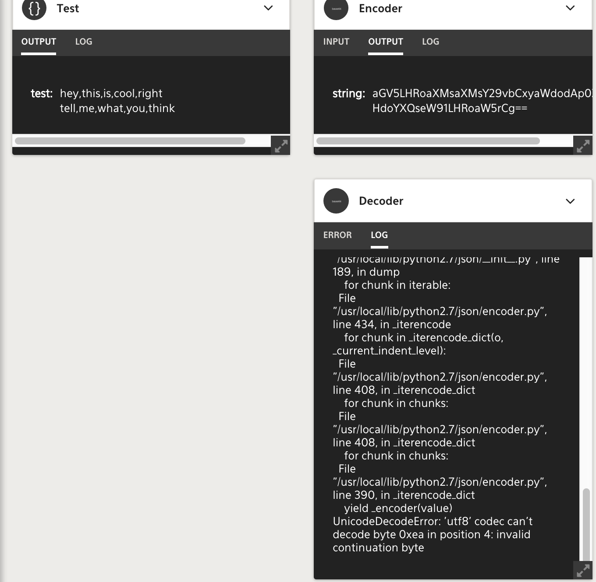
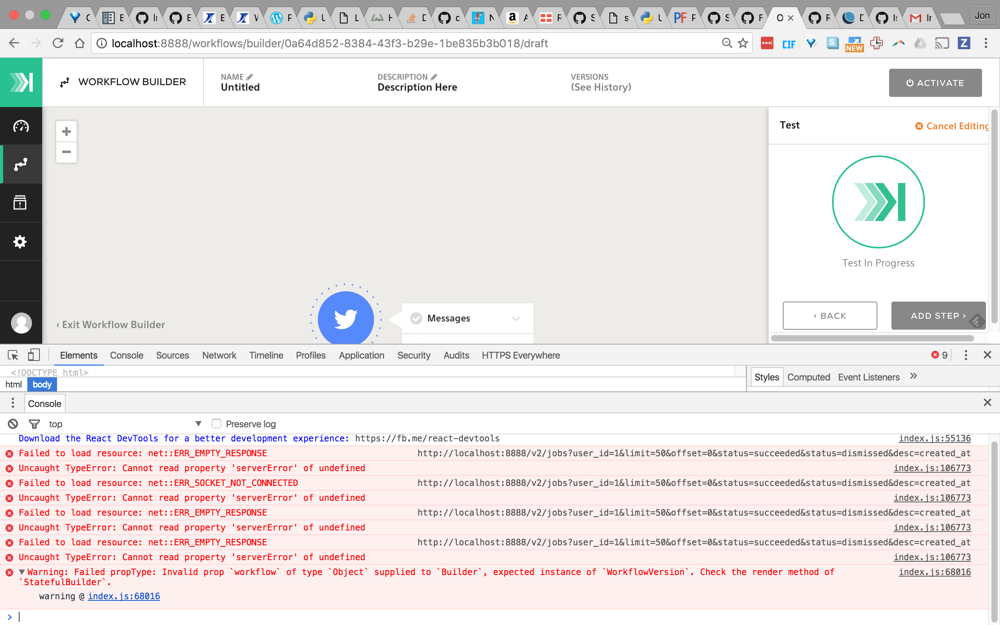

<!-- START doctoc generated TOC please keep comment here to allow auto update -->
<!-- DON'T EDIT THIS SECTION, INSTEAD RE-RUN doctoc TO UPDATE -->

## Trouble Shooting

### Plugins

#### UI

Errors and debug information can be found in the UI on the job page by viewing the Error and Log tabs.



#### Logs

The engine and web services contain logs that may help diagnose issues.

Enable debug logging to get the most out of them by adding the following line to `/opt/komand/etc/web.conf` and `/opt/komand/etc/engine.conf`.
```
KOMAND_LOG_LEVEL=debug
```

Then restart the services
```
systemctl restart komand-engine
systemctl restart komand-web
```

Now, investigate the logs
```
tail -f /var/log/komand/web.log
tail -f /var/log/komand/engine.log
```

#### Containers

You can view logs of running containers by interacting with Docker. This is helpful in cases where no jobs are created
by a trigger in the UI.

Obtain container ID
```
root@localhost ~]# docker ps
CONTAINER ID        IMAGE                  COMMAND                  CREATED             STATUS              PORTS
NAMES
ba7cdcd752fb        komand/twitter:0.1.0   "/usr/local/bin/koman"   12 minutes ago      Up 12 minutes
```

View logs in realtime from running container by id
```
[root@localhost ~]# docker logs -f ba7cdcd752fb
INFO:root:Using dispatcher config: {u'url':
u'http://127.0.0.1:8000/v2/workflows/0a64d852-8384-43f3-b29e-1be835b3b018/events?internal=1&api_key=2981d3fb-d7ca-47d7-9a05-ceb2123271d2'}
INFO:root:Connect: Creating Twitter client.
INFO:root:Right about to create API client
INFO:root:API Client created
INFO:requests.packages.urllib3.connectionpool:Starting new HTTPS connection (1): api.twitter.com
INFO:requests.packages.urllib3.connectionpool:Starting new HTTPS connection (1): api.twitter.com
INFO:root:Connect: Connected! ID: 778783652834582529, Username: Rusty Shackleford, ScreenName: DoctorPeepers12
INFO:root:OpenCacheFile: /var/cache/triggers_twitter_messages exists, returning it
INFO:root:Run: Iterating main loop
INFO:root:OpenCacheFile: /var/cache/triggers_twitter_messages exists, returning it
INFO:root:Run: Cached id is 787384615166152708.
INFO:requests.packages.urllib3.connectionpool:Starting new HTTPS connection (1): api.twitter.com
INFO:root:Get Messages: Got 0 messages.
INFO:root:Get Messages: Next sleep duration set to 360 seconds.
INFO:root:Run: No new messages. Sleeping 360 seconds.
```

### UI

Bugs can happen in the UI and cause unexpected results or block your work. To check for bugs, open your browser's
developer tools to look for errors. If found, report them to the Komand team in Slack.



### File Uploads

Testing file uploads via API trigger can be done with the following shell function.

```$ declare -f postfile
postfile ()
{
    local var="$1";
    local file="$2";
    local url="$3";
    local token="$4";
    local argc="$#";
    [[ $argc -ne 4 ]] && {
        printf "postfile <var> <path/file> <url> <key>\n" && return 0
    };
    b64=$(base64 ${file});
    json=$(echo -n '{'\""${var}"\"': '\""${b64}"\"'}');
    echo $json | eval curl -H \"Authorization: $token\" -H \"Content-Type: application/json\" -d @- $url
}
```

Usage, where <var> is the name of the API trigger variable for which the file will be the value (script only supports one currently).
```
$ postfile
postfile <var> <path/file> <url> <key>
```

Example: 
```
$ postfile pcap ~/google-http.pcap http://127.0.0.1:8888/v2/workflows/6535b9ba-1930-4c56-a5e2-1904b048a4ee/events bae09ddd-a593-4113-96a6-7cedb816cf1a
```
