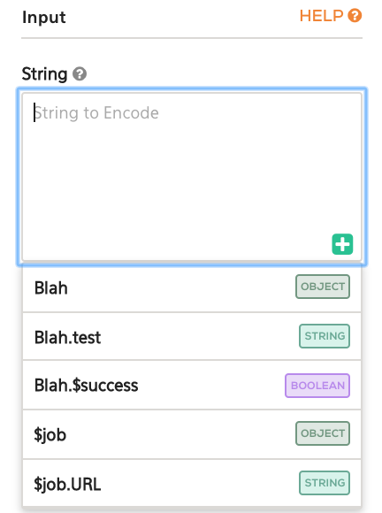

<!-- START doctoc generated TOC please keep comment here to allow auto update -->
<!-- DON'T EDIT THIS SECTION, INSTEAD RE-RUN doctoc TO UPDATE -->

## User Interface

### Special Variables

The following special variables, prefixed with a `$`, are available in the UI and can be used in workflows.

* `$success` of type `boolean` on whether the step succeeded.
* `$job` of type `object` which contains the output of all the completed steps in the workflow
* `$job.URL` of type `string` which contains the URL of the jobs page
